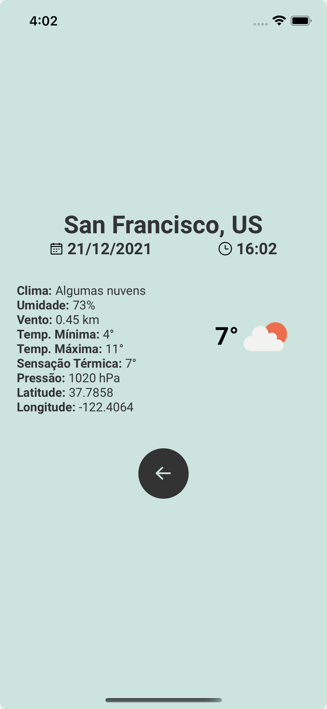

<div style="background: #00F; width: 100%;">
  <h1 align="center">
      
  </h1>
</div>

## 💻 Project

Test WiT for React Native Developers.

## :rocket: Technologies

This project was developed with the following technologies:

- [Expo](https://docs.expo.dev/)
- [React](https://reactjs.org)
- [React Native](https://facebook.github.io/react-native/)
- [Redux](https://redux.js.org/)
- [Styled-Components](https://styled-components.com/)
- [React Navigation](https://reactnavigation.org/)
- [Open Weather API](https://openweathermap.org/api)

## :information_source: How To Use

To clone and run this application, you'll need [Git](https://git-scm.com), [Node.js][nodejs] + [Yarn][yarn] and [Expo][expo] installed on your computer.

### Screens

<p align="center">
  
  
</p>

From your command line:

### Install App Android

```bash
# Clone this repository
$ git clone https://github.com/ViniCleFer/rn-weather.git

# Install dependencies
$ yarn install

# Run the APP
$ Expo start

# Initialize with Android Simulator
$ Press "a" to choose Android Simulator
```

### Install App IOS

```bash
# Clone this repository
$ git clone https://github.com/ViniCleFer/rn-weather.git

# Install dependencies
$ yarn install && npx pod-install

# Run the APP
$ Expo start

# Initialize with IOS Simulator
$ Press "i" to choose IOS Simulator
```

[expo]: https://docs.expo.dev/
[nodejs]: https://nodejs.org/
[yarn]: https://yarnpkg.com/
[vc]: https://code.visualstudio.com/
[vceditconfig]: https://marketplace.visualstudio.com/items?itemName=EditorConfig.EditorConfig
[vceslint]: https://marketplace.visualstudio.com/items?itemName=dbaeumer.vscode-eslint
[prettier]: https://marketplace.visualstudio.com/items?itemName=esbenp.prettier-vscode
